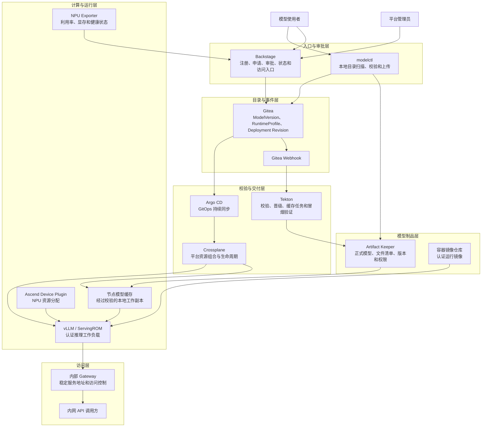
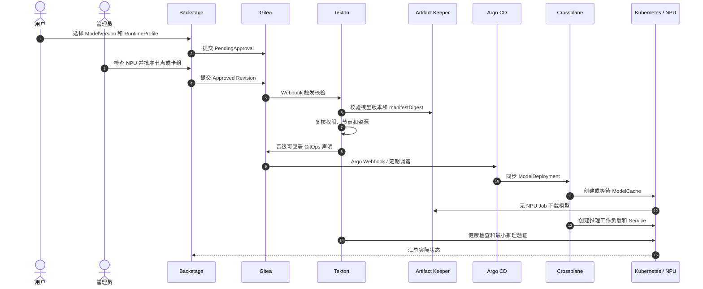

# 模型自动化集成平台生产接入方案

> 文档状态：第一版方案基线
>
> 确认日期：2026-08-10
>
> 目标环境：`server-00` 所在 K3s 集群
>
> 第一认证运行时：Qwen3.6-27B W8A8 + Ascend A3 + 现有 vLLM/ServingROM

## 1. 执行摘要

本方案用于把已经部署的 Artifact Keeper、现有 Ascend NPU 推理能力和原有平台 POC 经验，组合成一套可以交给其他使用者的模型注册、上传、审批、部署、访问、停止和回滚平台。

第一版不追求一次完成全部生产加固，而是先建立稳定的平台契约和完整可用闭环。用户只需要提供少量模型信息、执行一条上传命令并提交部署申请；管理员确认 NPU 状态并审批；平台完成模型校验、节点缓存、工作负载创建、推理验证和状态展示。

核心结论如下：

- Artifact Keeper 是正式模型制品仓库，不直接承担推理时的模型文件读取。
- NPU 节点保存经过校验的模型工作副本，称为节点模型缓存。
- Backstage 是用户入口，不传输 34GiB 等大文件，也不直接创建 Pod。
- Gitea 保存模型目录、部署意图、审批记录和发布 Revision。
- Tekton 负责校验、Webhook 触发和一次性流程任务。
- Argo CD 负责把 GitOps 期望状态持续同步到 Kubernetes。
- Crossplane 负责把高层模型部署声明组合成缓存任务、推理工作负载、Service 和路由。
- Kubernetes Device Plugin 负责 NPU 资源分配；NPU Exporter 提供实时设备状态。
- 第一版由管理员选择目标节点或预设卡组并审批，不做完全自动 NPU 调度。
- 第一版复用现有 Qwen3.6 Ascend 运行模板，不强制改造成 RayService。
- 平台从第一天定义稳定对象，后期增加专用 Controller 时不需要重建上传和部署链路。

## 2. 当前事实与边界

### 2.1 生产 K3s 环境现状

已确认目标集群为 K3s `v1.34.6+k3s1`，控制面节点为 `server-00`。集群包含多个 Ascend 节点：

| 节点类型 | 示例节点 | 架构 | NPU 资源 | 说明 |
|---|---|---|---:|---|
| Ascend A3 | `a3-server-00` | ARM64 | 16 × `huawei.com/Ascend910` | 当前 Qwen3.6 运行节点 |
| Ascend 910B3 | `gpu-server-00` 等 | ARM64 | 每节点 8 × `huawei.com/Ascend910` | 驱动和硬件与 A3 不完全相同 |

集群已经部署：

- Huawei Ascend Device Plugin。
- NPU Exporter。
- Prometheus、Grafana 等监控组件。
- 现有 Ray Head 和 Qwen3.6 推理工作负载。
- Artifact Keeper 核心服务。

原有 Backstage、Gitea、Tekton、Argo CD、Crossplane 的完整 POC 运行在独立 Kind 环境。不能假设这些组件已经部署到生产 K3s，实施前必须重新盘点。

### 2.2 Artifact Keeper 当前状态

| 项目 | 当前值 |
|---|---|
| Namespace | `artifact-keeper` |
| Helm Release | `artifact-keeper` |
| Chart | `1.7.5` |
| Backend | `1.6.0` |
| Web | `1.5.8` |
| PostgreSQL | `16-alpine` |
| 制品存储 | 480GiB Local PV |
| PostgreSQL 存储 | 20GiB Local PV |
| 模型仓库 | `model-artifacts` |
| 仓库格式 | Hugging Face |
| 仓库配额 | 430GiB |
| 单次上传上限 | 100GiB |

当前内部直连地址为：

```text
http://110.120.0.3:30670
```

该 NodePort 从 NPU 节点实测下载约 110MiB/s，但它是明文 HTTP，而且独立 Service 尚未正式纳入声明式部署材料。第一版平台接入可以在可信内网中临时使用，随后必须纳入 GitOps，并逐步替换为内部域名和 TLS。

当前已经上传：

```text
Qwen3.6-27B-w8a8/
```

模型约 34GiB，包含 9 个 Safetensors 权重分片、权重索引、配置、Tokenizer 和预处理文件。现有验收已经完成文件路径、大小、Artifact Keeper 元数据 SHA256 和实际下载内容 SHA256 对比。

### 2.3 当前 Qwen 推理方式

当前生产 Qwen 服务不是 KubeRay `RayService`，而是普通 Kubernetes Deployment：

```text
namespace: infra-learning
deployment: ray-vllm-pd-control-pilot-qwen36-27b
node: a3-server-00
```

关键资源：

```text
6 × huawei.com/Ascend910
64 CPU
256Gi memory
```

关键运行配置：

```text
MODEL_PATH=/models/Qwen3.6-27B-w8a8
MODEL_NAME=qwen36-27b-w8a8
RAY_ADDRESS=ray-vllm-lab-head.infra-learning.svc.cluster.local:6379
PHYSICAL_IDS=10,11,12,13,14,15
```

当前模型来源为 `a3-server-00` 本地目录：

```text
/home/admin/models/Qwen3.6-27B-w8a8
```

容器将它只读挂载到：

```text
/models/Qwen3.6-27B-w8a8
```

现有服务提供：

```text
/healthcheck
/v1/chat/completions
/v1/completions
```

它不提供 `/v1/models`。第一版验收必须使用实际存在的接口。

### 2.4 第一版范围

第一版包含：

1. 模型注册和一条命令上传。
2. 模型文件、格式和 SHA256 校验。
3. 不可变模型版本和模型目录展示。
4. 认证运行时和固定资源规格。
5. 用户部署申请。
6. 管理员查看 NPU 状态、选择节点或卡组并审批。
7. 节点模型缓存准备和复用。
8. 推理工作负载自动创建。
9. 健康检查和最小推理验证。
10. 内网 OpenAI 兼容接口。
11. 停止、重新启动、删除和回滚。
12. Backstage 状态和失败原因展示。

第一版暂不包含：

- 完全自动 NPU 调度。
- 多副本高可用。
- 蓝绿或灰度发布。
- 公网访问。
- 完整企业 TLS 和统一身份体系。
- Artifact Keeper 多副本和异机自动备份。
- 任意训练 Checkpoint 自动转换。
- 未经认证的任意模型运行镜像。
- 多个模型运行时同时上线。

## 3. 目标架构



### 3.1 控制面与数据面

平台必须区分控制面和数据面：

```text
控制面：Backstage、Gitea、Tekton、Argo CD、Crossplane
数据面：Artifact Keeper 文件上传下载、节点缓存、模型加载、推理请求
```

Backstage 只提交元数据和操作意图。34GiB 模型文件由 `modelctl` 直接上传 Artifact Keeper，不能经过浏览器或 Backstage 后端中转。

### 3.2 事实来源

| 数据 | 权威来源 | 说明 |
|---|---|---|
| 模型文件和文件 SHA256 | Artifact Keeper | 正式制品，不允许运行端覆盖 |
| 模型版本目录 | Gitea | 可审计、可评审、可回滚 |
| 部署意图和审批 | Gitea | 记录期望状态和 Revision |
| 实际 Pod、Service、NPU 分配 | Kubernetes | 实际运行状态 |
| 用户入口和聚合展示 | Backstage | 不作为底层状态唯一来源 |

## 4. 分层职责

| 层 | 组件 | 负责 | 不负责 |
|---|---|---|---|
| 用户入口 | Backstage | 表单、模型目录、部署申请、审批、状态和访问地址 | 传输大文件、直接创建 Pod |
| 上传工具 | `modelctl` | 扫描目录、计算摘要、断点上传、生成 ModelVersion | 调度 NPU、保存平台 Token 明文 |
| 模型仓库 | Artifact Keeper | 文件、版本、权限、下载和校验元数据 | 推理、NPU 调度 |
| Git 与审计 | Gitea | 模型目录、运行时目录、部署 Revision 和审批记录 | 执行流水线、运行模型 |
| 流水线 | Tekton | 校验、晋级、Webhook 任务、最小推理测试 | 长期保存模型 |
| GitOps | Argo CD | Git 与集群期望状态收敛 | 解释模型格式、选择 NPU |
| 平台资源 | Crossplane | 高层资源到 Job、Deployment、Service、Route 的组合 | 模型文件上传、用户认证 |
| NPU 基础设施 | Device Plugin、NPU Exporter | 资源分配和实时设备指标 | 模型版本管理 |
| 推理运行时 | vLLM、ServingROM、Ray | 加载本地模型并提供推理 API | 保存正式模型版本 |
| 网络入口 | Gateway | 内网稳定地址、路由、后续认证和 TLS | 模型加载、制品管理 |

## 5. 稳定核心对象

第一版固定四个稳定概念。它们是平台接口，不要求全部立即实现成 Kubernetes CRD。

### 5.1 ModelVersion

`ModelVersion` 表示一个不可变模型版本。建议存放在 Gitea 模型目录中，并引用 Artifact Keeper 中的正式文件。

```yaml
apiVersion: platform.example.com/v1alpha1
kind: ModelVersion
metadata:
  name: qwen3.6-27b-w8a8-20260810
  labels:
    owner: platform-team
    project: model-serving
spec:
  modelId: platform-team/qwen3.6-27b-w8a8
  revision: "20260810.1"
  artifact:
    repository: model-artifacts
    path: Qwen3.6-27B-w8a8
    manifestDigest: sha256:<canonical-manifest-digest>
  format:
    family: huggingface
    weights: safetensors
    architecture: qwen
    quantization: w8a8
  compatibility:
    runtimeProfiles:
      - qwen36-w8a8-ascend-a3-v1
```

身份规则：

```text
owner/model-name + immutable revision + manifestDigest
```

正式版本不允许覆盖。任何文件变化都产生新的 Revision 和 manifestDigest。

### 5.2 ModelRuntimeProfile

为避免与 Kubernetes 原生 `RuntimeClass` 混淆，平台运行时对象命名为 `ModelRuntimeProfile`。

它描述：

- 支持的模型架构、文件格式和量化方式。
- Ascend 型号、架构和驱动要求。
- 推理镜像及不可变 digest。
- vLLM、ServingROM 或 Ray 启动方式。
- NPU、CPU、内存和共享内存规格。
- 张量并行和物理设备映射方式。
- 节点选择器、挂载和安全上下文。
- Readiness、健康检查和最小推理测试。
- 工作负载实现类型，例如 Deployment 或 RayService。

第一认证 Profile：

```text
name: qwen36-w8a8-ascend-a3-v1
model: Qwen3.6-27B W8A8
hardware: Ascend A3
npu: 6
cpu: 64
memory: 256Gi
replicas: 1
workload: existing vLLM/ServingROM Deployment template
```

普通用户不能输入任意镜像、任意 NPU 数量或任意启动命令。

### 5.3 ModelDeployment

`ModelDeployment` 是用户可理解的部署意图，建议实现为 Crossplane XRD 生成的 namespaced CRD。

```yaml
apiVersion: platform.example.com/v1alpha1
kind: ModelDeployment
metadata:
  name: qwen36-demo
  namespace: model-serving
  labels:
    owner: demo-team
    project: demo
spec:
  projectRef: demo
  modelVersionRef: qwen3.6-27b-w8a8-20260810
  runtimeProfileRef: qwen36-w8a8-ascend-a3-v1
  desiredState: Running
  placement:
    acceleratorPool: ascend-a3
  access:
    visibility: internal
```

管理员审批后补充目标节点或预设卡组。普通用户不能直接填写物理卡号。

### 5.4 ModelCache

`ModelCache` 是平台内部对象，表示 Artifact Keeper 中某个模型版本在指定 NPU 节点上的经过校验的本地工作副本。

唯一键：

```text
nodeName + modelVersion + manifestDigest
```

示例：

```text
a3-server-00
+ qwen3.6-27b-w8a8-20260810
+ sha256:abc...
= 一个可复用的本地缓存
```

用户不填写缓存路径。Crossplane 根据批准的节点自动创建并等待 `ModelCache` 就绪。

## 6. 模型格式与扩展边界

### 6.1 第一版上传格式

第一版上传入口支持规范化 Hugging Face 模型目录，主要包含：

- `config.json`。
- Safetensors 权重或权重分片。
- Safetensors 索引文件。
- Tokenizer 配置和词表。
- Generation 配置。
- 模型运行需要的自定义配置。

第一版只有满足当前 Qwen3.6 W8A8 认证规则的版本才能部署。其他规范 Hugging Face 模型可以上传和登记，但状态标记为 `Unsupported`，不能选择未认证的运行时部署。

### 6.2 自训练模型

训练输出如果是 DeepSpeed、Megatron、PyTorch 分布式 Checkpoint 或其他训练态格式，必须先执行导出：

```text
训练 Checkpoint
-> Format Adapter / Exporter
-> Hugging Face + Safetensors 推理目录
-> 离线加载验证
-> modelctl publish
```

这样上传、版本、审批和部署主链路不需要为每种训练框架重建。未来新增的是 Format Adapter 和 ModelRuntimeProfile。

### 6.3 manifestDigest

`modelctl` 对规范化文件清单生成稳定摘要。清单至少包含：

```text
relativePath
size
sha256
```

文件按路径排序并使用规范化 JSON 编码，再计算整体 `manifestDigest`。部署申请引用整体摘要，运行端校验每个文件和整体摘要。

## 7. 模型注册与上传流程

### 7.1 用户输入

用户只填写：

```text
模型名称
所属项目
本地模型目录
版本说明
```

Backstage 创建待上传记录，并生成一条 `modelctl publish` 命令。文件位于哪台训练机或同步机，就在哪台机器执行命令。

### 7.2 modelctl 自动完成

`modelctl publish` 负责：

1. 检查目录存在性和可读性。
2. 识别 Hugging Face 配置、架构、权重和量化信息。
3. 校验必须文件和权重索引引用。
4. 计算每个文件 SHA256。
5. 生成规范化 manifest 和 manifestDigest。
6. 检查同版本是否已经存在。
7. 使用分片或断点续传上传 Artifact Keeper。
8. 上传完成后从服务端查询并复核元数据。
9. 提交 ModelVersion 到 Gitea。
10. 输出模型版本和状态地址。

用户不手工填写 SHA256、文件列表、Artifact Keeper 路径或运行镜像。

### 7.3 上传状态

```text
Uploading -> Validating -> Ready
                     \-> Unsupported
                     \-> Rejected
```

只有 `Ready` 的 ModelVersion 才能提交部署申请。

## 8. 部署申请与 NPU 审批

### 8.1 用户申请

用户选择：

- Ready 模型版本。
- 认证 ModelRuntimeProfile。
- 项目和服务名称。
- 期望状态 `Running`。

用户看见资源规格，但不能修改任意数值：

```text
Qwen3.6-27B W8A8 / Ascend A3
6 NPU / 64 CPU / 256Gi / 单副本
```

### 8.2 双重 NPU 状态检查

审批页同时展示：

1. Kubernetes Device Plugin 报告的 Capacity、Allocatable 和已请求数量。
2. NPU Exporter 报告的利用率、显存和设备健康状态。

出现以下情况时禁止批准：

- Kubernetes 认为空闲，但 NPU 实际仍有训练负载。
- 设备不健康。
- 驱动、芯片或架构与 RuntimeProfile 不兼容。
- 节点内存、磁盘或 CPU 不满足要求。
- 同一预设卡组已经被其他部署保留。

### 8.3 审批边界

普通用户只选择认证规格。管理员审批时选择：

```text
acceleratorPool: ascend-a3
targetNode: a3-server-00
npuCount: 6
cardGroup: 平台预设卡组，第一版按需启用
```

当前运行时显式使用 `PHYSICAL_IDS=10,11,12,13,14,15`。第一版可以把该组合建成管理员可选的预设卡组，但不能让普通用户填写物理卡号。

审批执行前必须再次检查资源，避免审批页面和实际部署之间发生竞争。第一版部署操作串行化；并发增加后使用 Kubernetes Lease 或专用调度 Controller 管理卡组锁。

## 9. 节点模型缓存

### 9.1 为什么需要缓存

Artifact Keeper 保存正式模型，NPU 推理运行时读取节点本地磁盘副本。它类似于容器镜像仓库与节点镜像缓存的关系：

```text
Artifact Keeper 正式模型
        |
        | 无 NPU 预取任务下载并校验
        v
NPU 节点本地模型缓存
        |
        | hostPath 或未来 CSI 只读挂载
        v
vLLM / ServingROM 推理容器
```

缓存不是内存缓存，而是磁盘目录。缓存丢失可以从 Artifact Keeper 重建，不能反过来把缓存当作正式模型唯一副本。

### 9.2 缓存目录

第一版可使用：

```text
/home/admin/model-cache/artifact-keeper/
  <model-id>/
    <manifest-digest>/
```

后期可以替换为 Local PV、CSI 本地卷或高性能共享存储，ModelDeployment 接口不变化。

### 9.3 缓存准备过程

```text
Pending -> Downloading -> Verifying -> Ready
                                \-> Failed
```

规则：

- 使用不申请 `huawei.com/Ascend910` 的 Job 下载模型。
- Job 只申请 CPU、内存、网络和磁盘。
- Job 固定到批准的目标节点。
- 下载到临时目录。
- 校验所有文件 SHA256 和 manifestDigest。
- 全部通过后原子切换到正式目录并写入 `READY` 标记。
- 失败下载不能覆盖已有有效缓存。
- 同一节点、同一 manifestDigest 只下载一次。
- 多个部署可以只读复用缓存。
- 正在被部署引用的缓存禁止清理。

不能让申请 6 张 NPU 的推理 Pod 在 initContainer 中下载 34GiB 模型，否则下载和校验期间 NPU 被无效占用，Pod 重建时还可能重复下载。

## 10. 推理部署与验收

### 10.1 第一版运行模板

第一版复用当前已经运行的 Qwen Deployment 模板，保持：

- 当前 ARM64 Ascend 运行镜像。
- vLLM/ServingROM 启动脚本。
- 现有 Ray Head 地址。
- NPU、CPU、内存和共享内存配置。
- Ascend 驱动、DCMI、HCCN 等挂载。
- 容器内 `MODEL_PATH=/models/Qwen3.6-27B-w8a8`。
- `/healthcheck` 和 OpenAI 兼容 API。

平台只把模型来源替换为对应 ModelCache 的只读目录，并将硬编码参数收敛进 ModelRuntimeProfile。

第一版不要求强制迁移为 RayService。未来可以新增使用 RayService 的 RuntimeProfile，或者在不改变 ModelDeployment 的情况下替换内部实现。

### 10.2 成功标准

不能仅以 Pod `Running` 判断部署成功。必须依次通过：

1. ModelCache SHA256 和 manifestDigest 校验成功。
2. Worker 被调度到批准的节点和 NPU。
3. Pod Readiness Probe 通过。
4. `/healthcheck` 返回健康。
5. 平台发送一次最小 `/v1/chat/completions` 请求。
6. 返回有效响应。
7. 实际模型名称、ModelVersion、运行镜像 digest 和资源分配与申请一致。

全部完成后才能将部署状态设为 `Running`。

### 10.3 部署状态

```text
PendingApproval
-> Approved
-> Prefetching
-> Deploying
-> Running
-> Stopping
-> Stopped
```

异常进入 `Failed`，并保留失败阶段：

```yaml
status:
  phase: Failed
  failedStage: Prefetching
  reason: ChecksumMismatch
  message: expected sha256:... but received sha256:...
```

## 11. 停止、重启、删除和回滚

### 11.1 Stop

`Stop` 将推理工作负载副本缩容到 0：

- 释放 NPU、CPU 和内存。
- 保留 Deployment 声明、Service、审批和审计记录。
- 保留节点模型缓存。
- 不删除 Artifact Keeper 中的 ModelVersion。

不能只删除 Worker Pod，因为 Deployment 会重新创建它。

### 11.2 Start

重新启动时：

1. 重新进入审批或资源确认。
2. 检查原节点缓存是否仍然 Ready。
3. 缓存存在则直接加载。
4. 缓存不存在则重新预取。
5. 重新执行健康和推理验证。

### 11.3 Delete

`Delete` 删除部署资源和访问入口，但不删除 ModelVersion。模型删除是独立高权限操作；存在部署引用时禁止删除正式模型。

### 11.4 Revision 与回滚

每次发布记录不可变 Revision：

```text
modelVersion
manifestDigest
runtimeProfile
runtimeImageDigest
resourceProfile
targetNode / npuCount
configurationRevision
```

更新模型、运行镜像或资源规格会创建新 Revision。失败时把期望 Revision 指回上一个版本。第一版采用单实例停机切换，不同时占用两组 NPU。

## 12. GitOps 与组件触发链路



Gitea 应分别向 Tekton 和 Argo CD 配置 Webhook。Webhook 用于立即触发，Argo CD 定期调谐作为漏事件兜底。不得把手工 `hard refresh` 作为正常发布步骤。

Backstage 页面不能一直等待一个同步 HTTP 请求。Scaffolder 提交后返回 deploymentId，页面通过状态接口或信号持续读取异步状态。

## 13. Namespace、RBAC、凭据和数据库

### 13.1 Namespace

第一版所有模型推理工作负载统一放在：

```text
model-serving
```

每个资源必须带：

```text
owner
project
modelVersion
deploymentId
managed-by
```

普通用户不能直接操作该 Namespace。Backstage、Tekton、Argo CD 和 Crossplane 使用独立 ServiceAccount。

ModelDeployment 从第一版保留 `projectRef`，后期可以平滑迁移到每团队一个 Namespace。

### 13.2 Artifact Keeper Token

至少分离：

| 身份 | 权限 | 使用位置 |
|---|---|---|
| `model-publisher` | 指定仓库上传和读取 | `modelctl` 或训练发布任务 |
| `model-runtime-reader` | 指定仓库只读下载 | ModelCache Job |
| 管理员 | 仓库、Token、删除和恢复 | 受控管理流程 |

Token 保存为 Kubernetes Secret 或本机受控凭据，不进入 Gitea、Backstage 模板、Helm values、命令历史和日志。

第一版使用 Kubernetes Secret。后期可以接入 Vault 或 External Secrets，不修改 ModelDeployment 接口。

### 13.3 数据库边界

第一版不增加统一平台数据库：

- Artifact Keeper 使用自己的 PostgreSQL。
- Gitea 使用自己的数据库。
- Backstage 使用自己的数据库。
- Kubernetes 保存资源实际状态。
- Gitea 保存模型目录和部署意图。

组件只通过 API 交互，不能直接读取其他组件数据库，也不应把所有数据库塞进一个共享数据库实例或共享表结构。

## 14. 内网访问方式

第一版只面向集群内或公司可信内网：

```text
http://<deployment-name>.model-serving.internal/v1
```

规则：

- 统一通过 Gateway 暴露。
- 不暴露 Worker Pod、Ray Dashboard 或内部 vLLM 实例端口。
- 每个项目使用独立 API Key。
- Backstage 展示访问地址和凭据申请入口，不显示密钥正文。
- 现阶段可以使用受限内网 HTTP，正式扩展使用内部 DNS 和 TLS。
- 外部 API 契约保持 OpenAI 兼容，增加 TLS 不要求调用方改变路径。

## 15. 第一版不开发复杂专用 Controller

第一版优先组合现有组件：

- Backstage 负责入口和审批。
- Tekton 负责校验和一次性任务。
- Argo CD 负责 GitOps 同步。
- Crossplane 负责资源组合。
- Device Plugin 和 NPU Exporter 负责资源与指标。

不能把复杂业务逻辑永久写进 Backstage 模板。稳定逻辑围绕四个核心对象表达。

后期专用 `model-platform-controller` 按以下顺序接入：

```text
观察状态，不修改资源
-> 计算状态和执行校验
-> 接管缓存与生命周期协调
-> 接管自动调度和卡组锁
```

已有 ModelDeployment 通过稳定 `deploymentId`、ModelVersion 和标签纳管，不需要重新上传模型或重建平台。

## 16. 从当前状态到第一版的实施路线

### 阶段 0：K3s 盘点与冻结接口

任务：

- 确认 K3s 已部署和未部署的平台组件。
- 确认内部镜像、Helm Chart 和离线依赖可用。
- 记录 A3、B3、驱动、Device Plugin 和 NPU Exporter 能力。
- 冻结四个核心对象 v1alpha1 接口。
- 确认 Artifact Keeper Hugging Face API 和 Token 权限。

验收：形成组件清单、版本矩阵、网络矩阵和缺口清单。

### 阶段 1：平台基础组件

推荐顺序：

1. Namespace、ServiceAccount、RBAC 和基础 Secret 引用。
2. Gitea。
3. Crossplane 和必要 Provider。
4. Argo CD。
5. Tekton Pipelines 和 Triggers。
6. Backstage。
7. Gateway 路由。

每个组件使用独立 Helm release，避免一个总 Chart 同时接管已有资源。

### 阶段 2：模型目录与上传

- 实现 ModelVersion Schema。
- 实现 `modelctl publish` 最小版本。
- 使用现有 Qwen3.6 执行上传、校验、重复上传和篡改失败测试。
- Backstage 展示 ModelVersion 状态。

验收：用户通过少量参数和一条命令得到 Ready 模型版本。

### 阶段 3：运行时和部署申请

- 将当前 Qwen Deployment 提炼为 ModelRuntimeProfile。
- 定义固定认证资源规格。
- 实现 ModelDeployment XRD 和 Composition。
- 实现 Backstage 申请与审批页面。
- 展示 Device Plugin 和 NPU Exporter 信息。

验收：管理员可以批准明确节点和资源，普通用户不能填写物理卡号或任意镜像。

### 阶段 4：缓存与推理闭环

- 实现 ModelCache 和无 NPU 预取 Job。
- 实现临时目录、SHA256、manifestDigest 和 READY 标记。
- 生成现有 vLLM/ServingROM 工作负载。
- 创建内部 Service 和 Gateway Route。
- 执行健康检查和最小对话测试。

验收：Artifact Keeper Qwen3.6 能从 Backstage 申请并在批准的 A3 节点运行。

### 阶段 5：生命周期与交付验收

- Stop、Start、Delete。
- Revision 和回滚。
- 失败阶段和日志入口。
- Webhook 立即触发和轮询兜底。
- 项目 API Key。

验收：完整执行发布、停止、重启、失败回滚和 NPU 释放。

### 阶段 6：后期加固

- Artifact Keeper NodePort 纳入声明式管理。
- 内部 DNS 和 TLS。
- Artifact Keeper 数据和 PostgreSQL 异机备份。
- 存储从单机 RAID0 迁移到可恢复方案。
- NetworkPolicy、Token 自动轮换和 External Secrets。
- 多租户 Namespace、ResourceQuota 和 LimitRange。
- 专用 Controller 和自动 NPU 调度。
- 多 RuntimeProfile、B3 适配和训练流水线自动发布。

## 17. 第一版正式验收标准

第一版必须完整完成以下闭环：

1. 用户在 Backstage 创建模型注册记录。
2. 用户执行一条 `modelctl publish` 命令上传模型。
3. Artifact Keeper 保存模型并完成文件和格式校验。
4. ModelVersion 在 Backstage 显示为 `Ready`。
5. 用户选择模型和认证资源规格提交部署申请。
6. 管理员查看 NPU 状态，选择节点或预设卡组并批准。
7. 平台自动准备 ModelCache 并校验模型。
8. 平台自动启动现有认证 Qwen 推理运行时。
9. 健康检查和最小推理请求通过后显示 `Running`。
10. 用户获得内网 OpenAI 兼容访问地址。
11. Stop 后 NPU 请求释放，缓存和模型版本保留。
12. Start 后可以复用有效缓存并重新验收。
13. 新 Revision 失败时可以恢复上一 Revision。
14. Backstage 显示明确失败阶段、原因和日志链接。

## 18. 关键风险与控制

| 风险 | 第一版控制 | 后期加固 |
|---|---|---|
| 训练与推理争抢 NPU | 双重状态检查、管理员审批、串行部署 | 专用调度 Controller、Lease、资源池 |
| 物理卡号硬编码 | 管理员预设卡组，不向用户暴露 | 自动设备分配和拓扑感知 |
| 模型下载占用 NPU | 独立无 NPU ModelCache Job | 节点缓存 Controller、预热策略 |
| 模型文件损坏 | 文件 SHA256 + manifestDigest 双校验 | 签名、证明和准入策略 |
| Artifact Keeper 单机 RAID0 | 上传者保留原始副本，不把仓库作为唯一副本 | 异机备份、共享或对象存储 |
| NodePort 明文 Token | 可信内网、最小权限短期 Token、限制来源 | 内部 DNS、TLS、Token 自动轮换 |
| Webhook 漏事件 | Argo CD 定期调谐兜底 | Webhook 监控和告警 |
| Backstage 长时间等待 | deploymentId + 异步状态读取 | Signals、事件流和专用 Controller |
| 多组件修改同一资源 | 明确资源所有权和字段边界 | Server-side apply field manager |
| 后期增加 Controller | 稳定四对象和标签契约 | 分阶段观察、接管和迁移 |

在 Artifact Keeper 完成异机备份前，必须执行“非唯一副本”策略：模型上传者或训练系统保留可重新发布的原始模型，不能删除唯一源文件。

## 19. 术语说明

| 术语 | 简明解释 |
|---|---|
| ModelVersion | Artifact Keeper 中一个不可覆盖的正式模型版本及其 Git 元数据。 |
| ModelRuntimeProfile | 一套经过平台验证的模型、运行镜像、硬件和资源组合。 |
| ModelDeployment | 用户希望某个模型以某个运行时运行或停止的声明。 |
| ModelCache | 正式模型在指定计算节点磁盘上的经过校验的可重建副本。 |
| manifestDigest | 对模型全部文件路径、大小和 SHA256 生成的整体内容指纹。 |
| GitOps | 以 Git 中的声明作为集群期望状态，由控制器持续同步。 |
| Crossplane Composition | 将高层平台资源组合成底层 Kubernetes 或外部资源的规则。 |
| Device Plugin | 把 Ascend NPU 作为 Kubernetes 可申请资源提供给调度器。 |
| NPU Exporter | 暴露 NPU 利用率、显存、温度和健康状态的监控组件。 |
| Revision | 一次不可变部署发布，包含模型、运行时、资源和配置版本。 |
| Reconcile | 控制器持续比较期望状态和实际状态并收敛差异。 |

## 20. 最终效果

第一版完成后，平台使用方式为：

```text
用户在 Backstage 注册模型
-> 在模型所在机器执行一条 modelctl publish
-> 平台校验并生成 Ready ModelVersion
-> 用户提交部署申请
-> 管理员确认 NPU 并批准
-> 平台准备节点缓存
-> Crossplane 创建认证推理运行时
-> 自动健康和对话验收
-> 用户获得固定内网 API
-> Stop 释放 NPU，Start 恢复服务，Revision 支持回滚
```

用户不需要理解 Artifact Keeper API、NPU 物理卡号、Deployment YAML、Ray 启动参数或模型缓存目录。平台管理员仍然能够从 Gitea、Tekton、Argo CD、Crossplane、Kubernetes 和 Artifact Keeper 追踪每一步状态。
