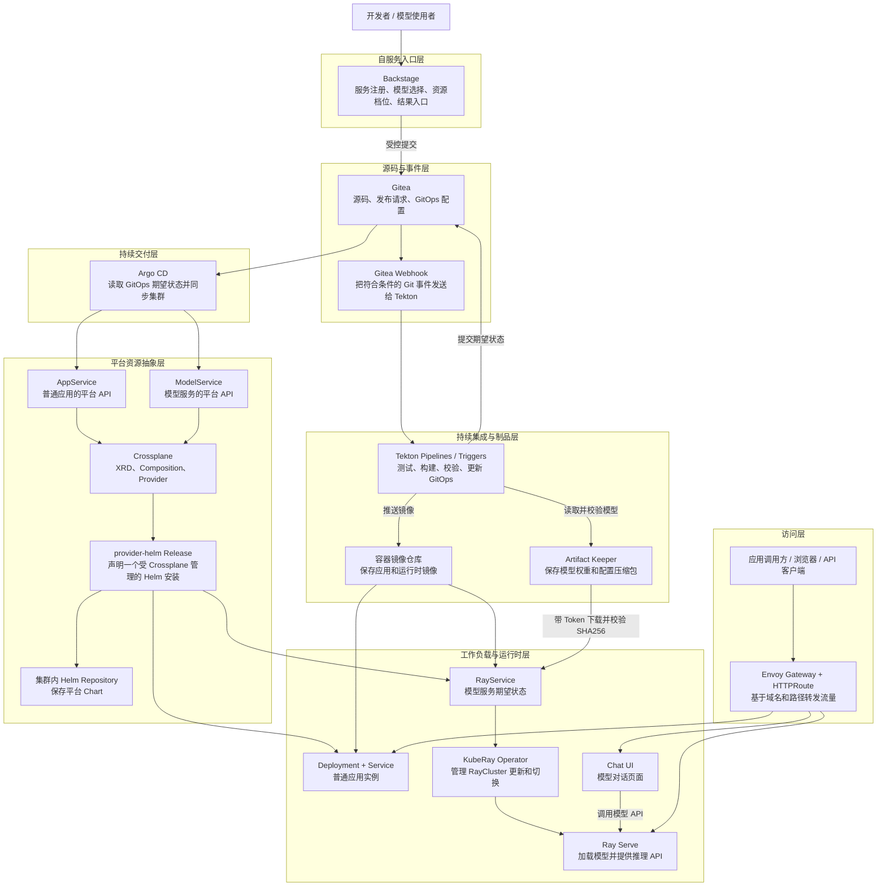
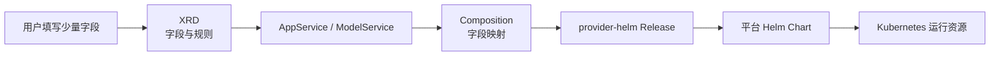
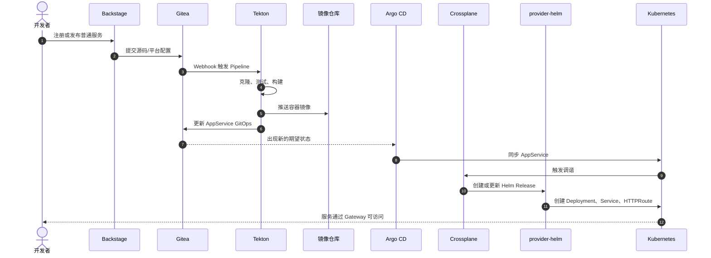
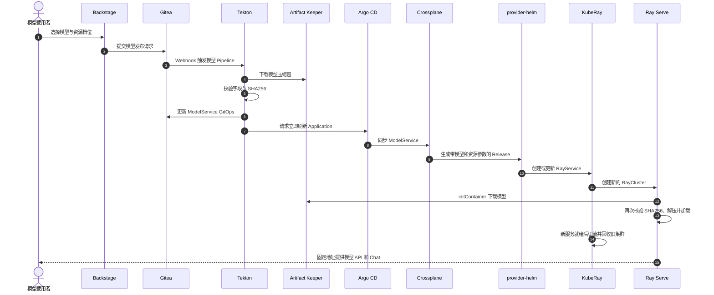
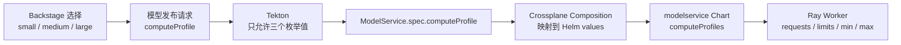

# 平台 POC 架构总览

> 更新日期：2026-08-05
> 本文说明当前 POC 由什么组成、每一层负责什么、各组件如何协作，以及迁移到生产环境时需要补齐什么。

## 1. 一句话理解

这是一个以 Backstage 为自服务入口、Gitea 为配置事实来源、Tekton 为 CI 引擎、Argo CD 为 GitOps 同步器、Crossplane 为平台资源控制器，并同时支持普通应用与 Ray 模型服务交付的平台 POC。

最终效果是：使用者只提交少量业务信息，平台自动完成校验、构建、制品引用、资源创建、部署、路由和状态收敛，而不是让使用者直接编写大量 Kubernetes YAML。

## 2. 完整架构图



图中的实线既包含控制指令，也包含数据读取。需要特别区分：GitOps 和 Crossplane 传递的是声明与制品引用；容器镜像来自镜像仓库，模型文件来自 Artifact Keeper，它们不会被放进 Git 或 Helm Chart。

## 3. 分层职责

| 层 | 当前组件 | 主要职责 | 不负责 |
|---|---|---|---|
| 基础设施层 | `server-00`、三节点 Kind、local-path、内部镜像仓库 | 提供 Kubernetes、CPU、内存、网络和存储 | 业务发布决策 |
| 自服务入口层 | Backstage | 收集少量参数，展示模板、结果链接和 Chat 入口 | 直接创建 Pod、保存模型大文件 |
| 源码与事件层 | Gitea | 保存源码、发布请求和 GitOps 文件；通过 Webhook 启动 CI | 构建镜像、运行工作负载 |
| CI 层 | Tekton Pipelines、Triggers、EventListener | 克隆、测试、构建、校验制品、更新 GitOps | 长期保存镜像或模型 |
| 制品层 | 容器镜像仓库、Artifact Keeper | 分别保存容器镜像与模型制品 | 决定 Kubernetes 资源数量 |
| GitOps CD 层 | Argo CD | 比较 Git 与集群状态并同步期望配置 | 展开平台 API、加载模型 |
| 平台 API 层 | Crossplane、XRD、Composition、provider-helm | 把 `AppService`、`ModelService` 转换成受管理的 Helm Release | 执行应用测试、保存制品 |
| 部署模板层 | 内部 Helm Repository、平台 Chart | 把结构化 values 渲染为 Kubernetes 资源 | 决定业务发布是否合规 |
| 运行时层 | Deployment、KubeRay、Ray Serve | 运行普通服务；创建、更新和切换模型集群 | 保存平台期望状态 |
| 访问层 | Envoy Gateway、HTTPRoute、Chat UI | 提供稳定域名、路径路由和用户访问入口 | 管理模型权重和 GitOps 状态 |

## 4. 核心平台概念

### 4.1 GitOps

GitOps 是“以 Git 中的声明作为集群期望状态”的交付方式。Tekton 不直接长期维护业务资源，而是修改 GitOps 文件；Argo CD 再将该文件同步到 Kubernetes。

这样可以从 Git commit 追踪谁在什么时候修改了模型、镜像或资源档位，并通过回退 Git 版本执行回滚。

### 4.2 Crossplane

Crossplane 是 Kubernetes 控制器框架。当前平台使用它定义两个面向平台用户的资源：

- `AppService`：普通 Web/API 服务。
- `ModelService`：基于 Ray Serve 的模型推理服务。

使用者提交的是简化后的平台资源，而不是 Deployment、Service、RayService 等底层对象。Crossplane 的 Composition 负责把平台字段映射到 Helm values。

Crossplane 当前主要管理业务服务和模型服务，不负责安装 Gitea、Tekton、Argo CD、Backstage 等平台基础组件。

### 4.3 XRD 与 Composition

- **XRD（CompositeResourceDefinition）**：定义平台 API 的字段、类型、默认值和校验规则，可理解为平台资源的接口定义。
- **Composition**：定义这个平台资源应展开成哪些受管理资源，以及字段如何映射。
- **provider-helm**：Crossplane Provider，将 Composition 生成的 `Release` 转换为实际 Helm 安装。



### 4.4 KubeRay 与 Ray Serve

- **KubeRay**：负责 Ray 集群在 Kubernetes 中的创建、更新、健康检查和新旧集群切换。
- **Ray Serve**：运行模型加载代码并提供推理 API。
- **Ray Head**：Ray 控制面，不承担模型推理。
- **Ray Worker**：下载、加载模型并执行推理。

模型切换时，KubeRay 可以先准备新 RayCluster，确认服务可用后再切流，并回收旧集群。对外服务名保持不变。

### 4.5 制品与 checksum

普通应用和模型使用两类不同制品：

| 类型 | 保存位置 | 示例 |
|---|---|---|
| 容器镜像 | 容器镜像仓库 | 应用镜像、Backstage 镜像、Ray Runtime 镜像 |
| 模型制品 | Artifact Keeper | `model.safetensors`、配置和 tokenizer 的 `.tar.gz` |

模型发布请求携带 SHA256 checksum。Tekton 下载制品并计算一次 SHA256；Ray Worker 的 initContainer 在部署下载后再次校验。只有实际文件与 Git 中登记的 checksum 一致，模型才会被解压和加载。

### 4.6 常用术语

| 术语 | 简明解释 |
|---|---|
| CI（持续集成） | 对提交自动执行克隆、测试、构建和制品校验。当前由 Tekton 承担。 |
| CD（持续交付） | 将通过校验的期望状态自动部署到目标环境。当前由 Argo CD、Crossplane 和 Helm 协作完成。 |
| Controller（控制器） | 持续比较期望状态和实际状态，并执行调谐使二者一致的程序。Argo CD、Crossplane 和 KubeRay 都包含控制器。 |
| CRD（CustomResourceDefinition） | 给 Kubernetes 增加一种新的资源类型，例如 `RayService`。 |
| CR（Custom Resource） | 按 CRD 创建的具体资源实例，例如 `models/chat-demo` 这个 `ModelService`。 |
| Helm Chart | 一组可参数化的 Kubernetes 资源模板。Helm 根据 values 生成并安装实际资源。 |
| Provider | Crossplane 连接外部 API 的插件。`provider-helm` 让 Crossplane 可以管理 Helm release。 |
| Registry | 保存和分发容器镜像的仓库，不保存模型权重压缩包。 |
| Gateway / HTTPRoute | Gateway 是统一流量入口；HTTPRoute 按域名和路径把请求转发到具体 Service。 |
| Reconcile（调谐） | 控制器发现差异后创建、更新或删除资源，直到实际状态符合声明。 |

## 5. 普通应用交付链路



普通应用链路已经在 `fastapi-demo-2` 等服务上验证。平台将源码 CI、镜像构建和运行资源分离，镜像变化通过 GitOps 声明进入 CD。

## 6. 模型服务交付链路



当前已验证 Qwen2.5 0.5B Instruct 与 SmolLM2 360M Instruct 使用同一个 `chat-demo` 服务名相互切换。当前 Backstage 仍使用两个预登记模型，不支持任意模型上传后自动加入选择列表。

## 7. 资源档位如何生效

Backstage 只允许申请三个受控档位。申请值经过 Gitea、Tekton、ModelService、Crossplane Composition 和 Helm，最终成为 Ray Worker 的资源配置。

| 档位 | 单 Worker request | 单 Worker limit | Worker 范围 |
|---|---:|---:|---:|
| Small | 1 CPU / 2 GiB | 2 CPU / 4 GiB | 固定 1 |
| Medium | 2 CPU / 4 GiB | 4 CPU / 8 GiB | 1-2 |
| Large | 4 CPU / 8 GiB | 8 CPU / 16 GiB | 1-3 |



档位不是在浏览器中直接修改 Pod，而是作为受审计的 GitOps 字段逐层传递。这样可以限制资源范围，并保证 Git、Crossplane、Helm 和实际 Pod 使用同一个值。

## 8. 当前主要 Kubernetes 资源

| Namespace / 位置 | 主要资源 | 用途 |
|---|---|---|
| `gitea` | Gitea、PostgreSQL HA、Pgpool、Valkey | Git 服务、Webhook 和平台配置存储 |
| `ci` | Tekton Pipeline、Task、PipelineRun、EventListener | 普通应用和模型发布 CI |
| `argocd` | Argo CD Application、repo-server、application-controller | GitOps 检测与同步 |
| `crossplane-system` | Crossplane、provider-helm、provider-kubernetes | 平台资源调谐与外部 Provider |
| `default` | 平台 XRD、Composition 的 Helm release | 安装平台 API 定义 |
| `backstage` | Backstage、PostgreSQL | 自服务门户和 Scaffolder Action |
| `artifacts` | Artifact Keeper、PostgreSQL、OpenSearch、PVC | 模型制品、元数据与搜索 |
| `kuberay-system` | KubeRay Operator | RayService 与 RayCluster 控制器 |
| `models` | ModelService、Helm Release、RayService、RayCluster、Chat UI | 模型服务运行资源 |
| `demo` | Gateway、普通示例应用 | 统一入口和普通服务演示 |
| `platform-system` | 集群内 Helm Repository | 提供 Crossplane 使用的平台 Chart |
| `server-00` | 内部容器镜像仓库、Kind 节点 | 保存镜像并承载 POC 集群 |

三节点 Kind 当前仅使用 CPU、内存和本地磁盘，不使用 GPU 或 NPU。`local-path` 存储适合 POC，但不等于生产级共享存储。

## 9. 控制面与数据面

理解平台时，可以把组件分成两类：

### 9.1 控制面

控制面负责决定“应该运行什么”：

```text
Backstage -> Gitea -> Tekton -> Argo CD -> Crossplane -> Helm -> KubeRay
```

它保存声明、执行校验并持续调谐状态。

### 9.2 数据面

数据面负责真正处理请求和传输制品：

```text
镜像仓库 -> 应用 Pod
Artifact Keeper -> Ray Worker
客户端 -> Gateway -> 应用 / Ray Serve
```

控制面故障可能阻止新发布，但已经运行的数据面服务可能继续提供请求；具体持续时间取决于故障类型和依赖状态。

## 10. 状态、追踪与安全边界

一次发布可以沿以下对象追踪：

```text
Gitea commit
-> Tekton PipelineRun / TaskRun
-> Argo CD Application revision
-> AppService 或 ModelService
-> Crossplane managed Release
-> Helm release
-> Deployment 或 RayService
-> Pod / API
```

当前安全措施包括：

- Token 保存在 Kubernetes Secret，不写入 Git。
- Artifact Keeper 的 CI Token 与 Runtime 下载 Token 分离。
- 模型使用不可变 revision 和 SHA256 校验。
- Backstage 只提供模型枚举和受控资源档位。
- GitOps 回写提交使用过滤条件，避免重复触发模型 Pipeline。
- Tekton 仅被授予刷新指定 Argo Application 的权限。

当前没有独立 Secret Manager。Kubernetes Secret 是 POC 的凭据保存方式，生产环境需要接入 Vault、External Secrets 或等价系统，并建立轮换流程。

## 11. 当前完成度

| 能力 | 状态 |
|---|---|
| 普通应用从 Gitea CI 到 Crossplane 部署 | 已验证 |
| 两个模型制品保存于 Artifact Keeper | 已验证 |
| Tekton 下载并校验模型 SHA256 | 已验证 |
| ModelService、Crossplane、Helm、KubeRay 部署 | 已验证 |
| Qwen 与 SmolLM2 固定地址切换 | 已验证 |
| Chat UI 与模型 API | 已验证 |
| Backstage 模型选择 | 已验证 |
| Small、Medium、Large 资源档位 | 已验证 |
| CI 推送后主动刷新 Argo CD | 已配置，需通过下一次发布复验 |
| 通用模型上传与自动登记 | 未实现；当前两个模型预先登记 |
| 稳定 DNS、TLS 和正式入口 | 未实现；部分入口仍依赖端口转发 |
| 独立 Secret Manager | 未实现 |
| 多环境审批与生产发布 | 未实现 |
| 生产级高可用、共享存储和灾备 | 未实现 |

## 12. 最终达到的效果

### 对普通应用开发者

开发者提交代码或通过 Backstage 注册服务后，平台自动测试、构建镜像、更新 GitOps，并创建 Deployment、Service 和路由。

### 对模型使用者

使用者在 Backstage 中选择已验证模型和资源档位。平台自动验证模型制品、更新 GitOps、创建或更新 RayService，并在固定地址提供模型 API 和 Chat 页面。

### 对平台团队

平台团队通过 XRD、Composition 和 Helm Chart 固化运行时、资源边界、Secret 引用、路由和验证规则。业务用户只接触稳定的平台 API，不直接操作复杂底层资源。

### 对审计和故障定位

每次变更都可以从 Git commit 一直追踪到 Pod。错误可以定位在 Webhook、Pipeline、制品校验、Argo 同步、Crossplane 调谐、Helm、KubeRay 或运行时，而不是只看到最终 Pod 失败。

## 13. 迁移到生产环境的重点

POC 的控制链可以保留，生产迁移主要是替换基础设施并补齐治理能力。

| 方向 | POC 当前状态 | 生产目标 |
|---|---|---|
| Kubernetes | 单台服务器上的 Kind | 正式多节点集群、故障域和容量规划 |
| 入口 | 部分依赖 port-forward 和临时域名 | 内部 DNS、Gateway/Ingress、HTTPS、证书自动轮换 |
| Git | Gitea POC 部署 | 稳定存储、数据库高可用、备份恢复、统一 canonical URL |
| 镜像仓库 | 内部 HTTP Registry | TLS、认证、镜像保留、复制、扫描和备份 |
| 模型制品 | Artifact Keeper POC PVC | 独立 Helm release、生产数据库、跨节点存储、备份和恢复演练 |
| CI/CD | 单环境自动发布 | 开发/测试/生产分层、审批、并发控制和发布策略 |
| Crossplane | 单集群平台 API | Composition 版本管理、策略校验、环境化配置和升级兼容 |
| 模型运行时 | CPU 小模型 | 按硬件 Profile 扩展 GPU/NPU、节点调度和容量配额 |
| Secret | Kubernetes Secret | Secret Manager、短期凭据、轮换和审计 |
| 可观测性 | 主要依靠 kubectl 和组件状态 | 指标、日志、Trace、告警、SLO 和容量趋势 |
| 安全供应链 | checksum 与固定镜像版本 | 镜像 digest、签名、SBOM、漏洞扫描、模型签名和准入策略 |
| 灾备 | 手工备份和局部恢复 | 明确 RPO/RTO、自动备份、跨故障域恢复演练 |

建议迁移顺序：

```text
1. 固定 DNS、HTTPS、Registry、Git 和 Artifact API 契约
2. 建立生产 Kubernetes、数据库、存储和备份
3. 迁移 Secret 与最小权限 RBAC
4. 安装并验证平台控制面
5. 迁移 AppService 普通应用链路
6. 迁移 Artifact Keeper 与 ModelService 链路
7. 增加多环境审批、可观测性和供应链安全
8. 最后接入 GPU/NPU Runtime 与生产容量策略
```

## 14. 相关文档

- `model-serving-poc-design.md`：模型服务目标设计与执行路线。
- `model-serving-poc-implementation-log.md`：模型服务实际实施和问题记录。
- `artifact-keeper-production-architecture.md`：Artifact Keeper 独立生产部署与接入框架。
- `AGENTS.md`：环境、资源和恢复上下文。
